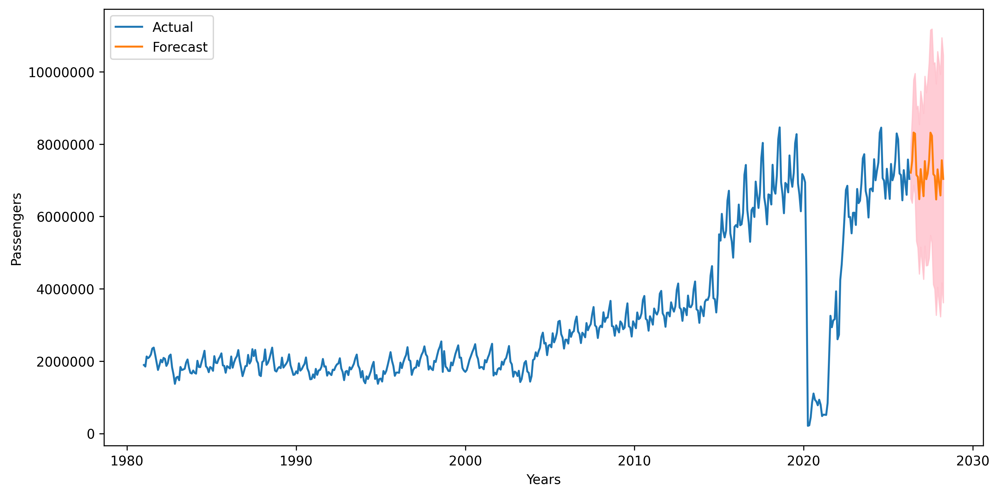

# aviation_forecasting_canada

---
> [!IMPORTANT]
> I have started working on this project again to automate forecasting :) \
> This project is done using the data published by [`Stats Canada`](https://www150.statcan.gc.ca/t1/tbl1/en/tv.action?pid=2310007901)

___

> ### <u> Goal </u>
> Forecast passenger data from 2025 November to 2027 october using the past 44 years of aviation passenger data from Statistics Canada.

> click [`here`](report/report.md) to see the report.

## Forecast

Forecasted passenger data
click [here](dataset/future_forecast.csv) to see the forecasted passenger data

> ### License
> This project is licensed under [MIT License](LICENSE)

---
